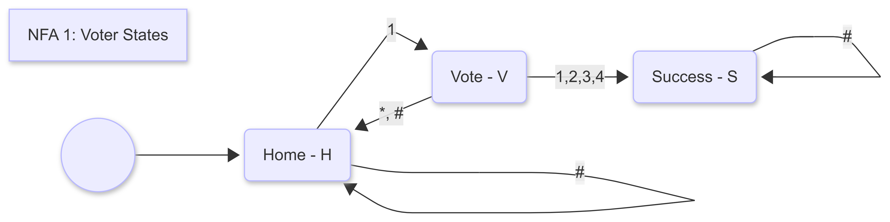
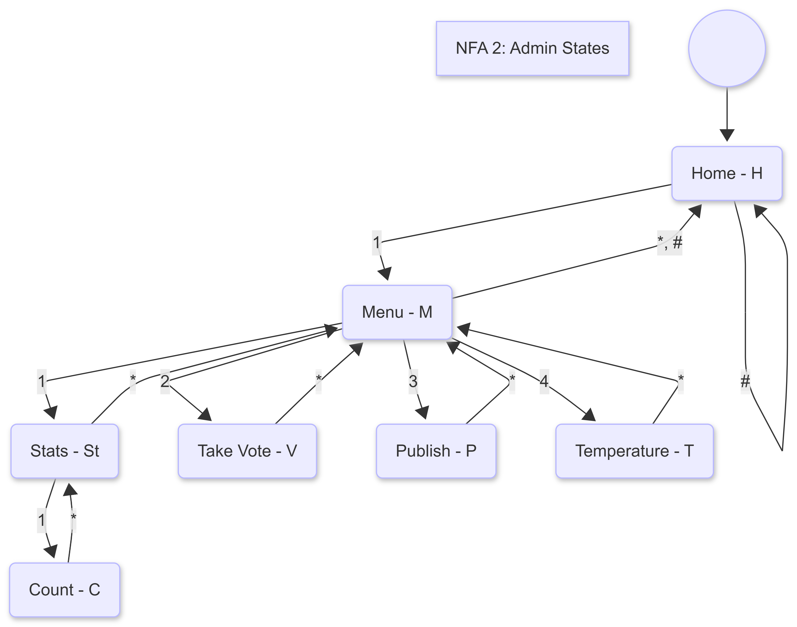
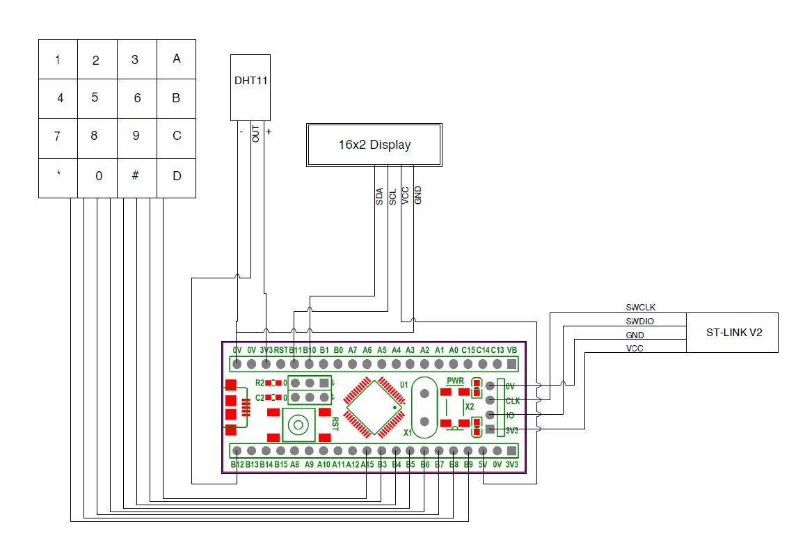
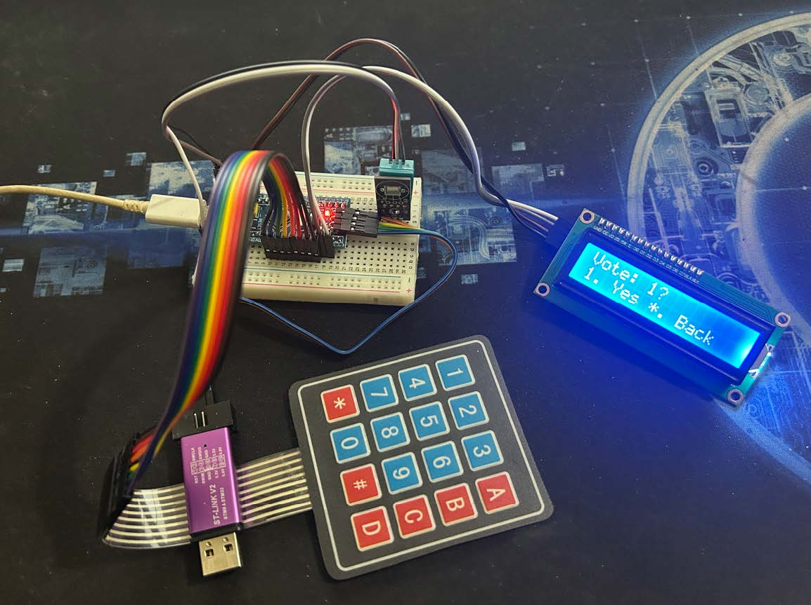

# STM32-EVM

## Overview

This repository contains the implementation of an Electronic Voting Machine (EVM) system using an STM32 microcontroller (Blue Pill). The system provides a secure, efficient, and user-friendly method for conducting elections, managed by a Nondeterministic Finite Automata (NFA) for state transitions. It features a 16x2 LCD display for prompts and results, a 4x4 matrix keypad for user input, and a DHT11 sensor for monitoring temperature and humidity.

This project was developed as part of CSE331L Section 12, Group 4, under the faculty of Dr. Md Arifur Rahman.

## System Components

The main components of the EVM system are:

- **STM32 Blue Pill**: The core microcontroller for processing.
- **ST-Link V2**: Used for uploading code to the microcontroller.
- **16x2 LCD Display**: Displays system prompts, voting options, and results (interfaced via I2C2 protocol).
- **4x4 Keypad**: Collects user inputs for selecting candidates or operations (connected via pins B9-A15).
- **DHT11 Temperature Sensor**: Monitors ambient temperature and relative humidity (connected via pin B12).

## Methodology

### Hardware Interfacing

- **STM32 Blue Pill**: Chosen for affordability, efficiency, and peripheral compatibility. Acts as the central processing unit.
- **16x2 LCD Display**: Shows prompts, candidate options, and confirmation messages. Uses I2C2 due to pin requirements for the keypad.
- **4x4 Keypad**: Scans and decodes key presses for user interaction.
- **DHT11 Temperature Sensor**: Provides real-time environmental data.

### Software Design

The system uses a Nondeterministic Finite Automata (NFA) to manage state transitions. Below is a table of states, options, and descriptions:

| State         | Options                          | Description                                                                 |
|---------------|----------------------------------|-----------------------------------------------------------------------------|
| PROLOGUE     | N/A                              | Initial state of the system. Redirects to HOME when the Passkey is entered. |
| HOME         | [Admin] 1 Menu # Exit [Voter] 1 Vote # Exit | Home screen.                                                               |
| MENU         | 1 Stats 3 Take Vote 3 Publish 4 Temperature | Menu screen. Admin chooses different options from here.                    |
| VOTE         | 1 Cand_A 3 Cand_B 3 Cand_C 4 Cand_D | Voting screen for voters.                                                  |
| CONFIRMATION | 1 Yes * Back                     | Confirmation dialog for the voter.                                          |
| STAT         | 1 Vote counts * Back # Exit      | Different statistics options are listed on this screen.                     |
| COUNT        | * Back # Exit                    | Vote counts of each candidate.                                              |
| SUCCESS      | N/A                              | Voting succeeded.                                                           |
| ADMIN_LOGIN  | N/A                              | Admin logged in successfully.                                               |
| PUBLISH      | * Back # Exit                    | Vote published. Results will be displayed here.                             |
| TEMPERATURE  | * Back # Exit                    | Temperature and Humidity can be checked on this screen.                     |

## State Transitions

The NFA handles transitions for voters and admins separately.

- **Voter NFA States**: Transitions include Home → Vote → Confirmation → Success, with back/exit options (*, #).

 

- **Admin NFA States**: Transitions include Home → Menu → Stats/Count/Publish/Temperature, with navigation options.

## Overall System Flow

1. The system starts in PROLOGUE_STATE.
2. It scans for keypresses; upon matching the Passkey, it redirects to HOME_STATE with admin privileges.
3. Admins can perform actions like Take Votes, See Statistics, Publish Vote Results, etc. Navigation uses keypad keys, "*" to go back, and "#" to return home.
4. Selecting "Take Vote" redirects to HOME_STATE as a voter.
5. Voters have limited functionality: cast vote only, no menu access.
6. After voting, a confirmation window appears; upon confirmation, a success message is shown, and the system freezes for the voter.
7. The system reactivates only when an admin enters the Passkey, redirecting to HOME_STATE.

## Circuit Diagram

## Finished Project

## Installation and Setup

1. Clone the repository: `git clone https://github.com/sarwar76200/STM32-EVM.git`
2. Use ST-Link V2 to upload the code to the STM32 Blue Pill.
3. Assemble the hardware as per the circuit diagram.
4. Ensure all peripherals (LCD, keypad, DHT11) are connected correctly.

Note: This project uses STM32CubeIDE or similar for development. No additional packages are required beyond standard libraries.

## Usage

- **Admin Mode**: Enter the Passkey to access admin features like viewing stats, publishing results, or checking temperature.
- **Voter Mode**: Select a candidate, confirm, and vote.
- **Navigation**: Use "*" for back and "#" for exit/home.
- **Temperature Check**: Available in admin menu to display real-time data from DHT11.

## Testing and Results

The system was thoroughly tested:

- The overall system operates smoothly without issues.
- State transitions occur error-free.
- Admin controls are securely handled.
- The UI is responsive and intuitive.

Some unexpected behaviors were noted due to a faulty keypad; replacing it resolves the issue.

## Conclusion

This project demonstrates a reliable EVM using an STM32 microcontroller, with NFA for structured state management and an intuitive LCD/keypad interface. It is scalable and can be extended with features like wireless communication or biometric authentication.

For the full project report, refer to the attached `Project Report.pdf` in the repository.
